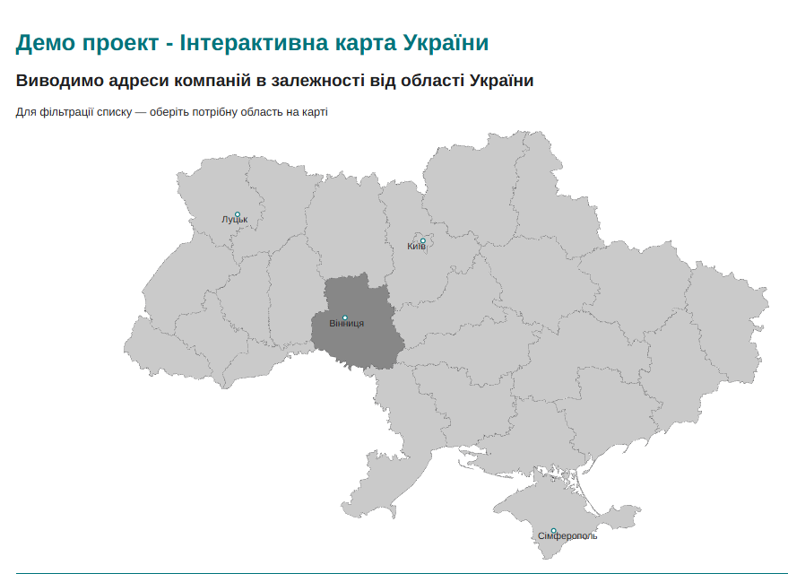
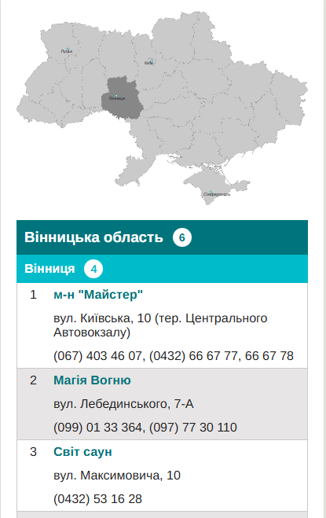

# Map Shops Demo

🔗 **Live Demo:** [https://map-shops-demo.netlify.app/](https://map-shops-demo.netlify.app/)

## Project Overview

This project features an **SVG map of Ukraine**, divided into regions. By clicking on a region, the user can see a list of shops/branches located in that area.

The project is built using:

- HTML
- CSS
- Vanilla JavaScript

Unit tests are included using **Jest**.

---

## Getting Started

### 1. Clone the repository
```bash
git clone https://github.com/luba150278/map-shops-demo-project
cd map-project
```
### 2. Install dependencies
```bash
npm install
```

### 3. Run the project
```bash
npm run start
```
This will launch a local server with the project (using live-server) and open it in your browser.

### 4. Run tests
```bash
npm run test
```
This will execute unit tests using Jest.

### Map Demo 


### Shop List Demo
